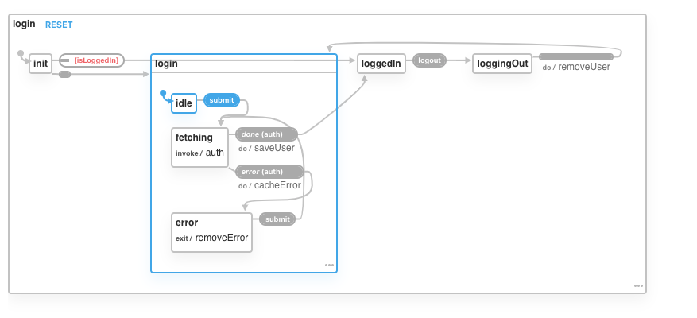
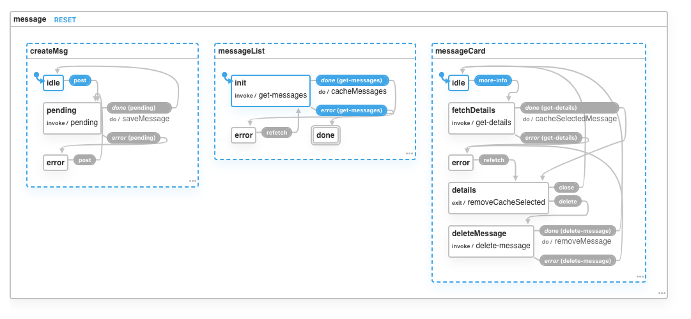

# Simple Message

For the front end, I've decided to go with `React` (create-react-app). For styling I've decided to go with `Chakra UI`. I really like this library because it uses `styled-system` under the hood. I am a big fan of having an API for styling on the component, rather than defining my CSS. I've also used `xstate` for state management. I prefer this library over any other state management library because it promotes the usage of state machines, meaning you can only be in a state that you've declared. It also has a visualizer to help you reason about your state.

Back end I went with express, postgres and sequelize. I used docker-compose with nodemon for local development.

## Getting started

```
# Clone the repo
https://github.com/mkallies/simple-message.git

# Front end
cd client
yarn install
yarn start

# Test
yarn test

# Build
yarn build

# API
cd api

# Run locally
docker-compose up

# To develop
docker-compose up --build

# Test
npm i // local deps
npm test
// Or run via docker
cd .. // base directory
docker build --target test -t app-test .
docker run app-test

```

## Client

Auth machine

[Interact with auth machine](https://xstate.js.org/viz/?gist=42125538df2786290872aaa9dad945db)



Message machine

[Interact with message machine](https://xstate.js.org/viz/?gist=fa179ad899f5821715239f28967c03b0)



## API

User

| METHOD | DESCRIPTION        | ENDPOINTS   | REQ BODY          |
| ------ | ------------------ | ----------- | ----------------- |
| POST   | Create or get user | `/api/user` | { email: string } |

Message

| METHOD | DESCRIPTION      | ENDPOINTS                  | REQ BODY                            |
| ------ | ---------------- | -------------------------- | ----------------------------------- |
| POST   | Add a message    | `/api/messages`            | { userId: string, content: string } |
| GET    | Get all messages | `/api/messages`            |
| GET    | Get a message    | `/api/messages/:messageId` |
| DELETE | Remove a message | `/api/messages/:messageId` |
